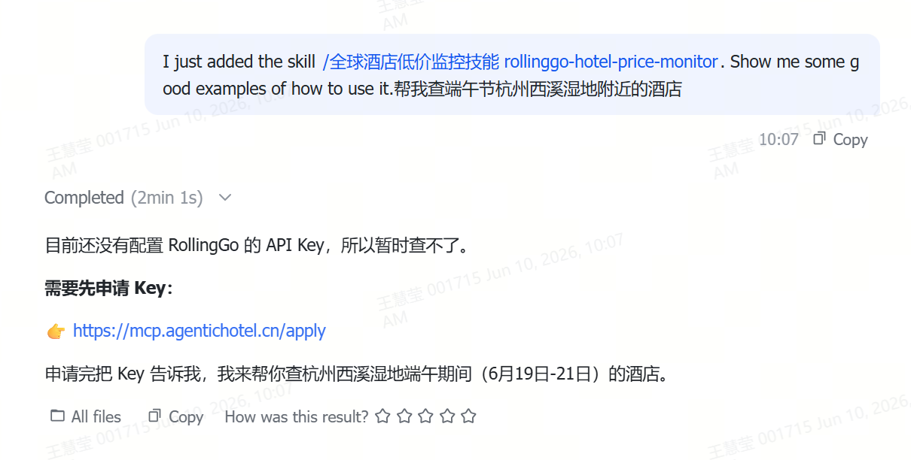

# 我心仪的酒店降价了.skill
我心仪的酒店降价了.skill 是一个面向旅行用户、差旅用户和 AI Agent 场景的酒店价格监控 Skill。提供 200 万 + 酒店搜索、降价提醒、可订检查和订单创建能力，让 AI 一键拥有原生酒店监控&预订功能，企业和个人均可一键接入，完全免费。

用户不需要反复打开多个平台手动刷价格，只需要用自然语言告诉 AI 想关注的酒店、目的地、入住日期、预算阈值或偏好条件，Skill 就可以帮助用户持续追踪酒店价格变化，并在价格降到目标范围时提醒用户查看。它适合用于心仪酒店降价提醒、高星酒店捡漏、热门目的地价格监控、商务差旅住宿筛选等场景，把原本繁琐的“查酒店、比价格、盯变化”流程变成自动化任务。对于已经看中某家酒店但还在等更合适价格的用户来说，这个 Skill 就像一个 24 小时在线的酒店价格小雷达，帮用户及时捕捉降价机会，并引导用户进入后续预订流程。

访问[rollinggo.store](https://rollinggo.store/)申请API Key——因酒店/机票价格、库存和订单能力涉及真实交易链路，因此我们需要为每个Skill用户开通免费专属的独立 KEY，永久调用额度现仍能申请。


> **面向**：使用 ClawHub / 扣子 / Qclaw / claude code / codex 等agent平台

> **目标**：安装和使用 RollingGo 的 Skill 技能包

---

## 概览

RollingGo 提供 3 个 Skill，安装在 Agent 平台中使用：

| Skill | 功能 | 版本 |
|-------|------|------|
| **RollingGo 全能订酒店** | 酒店搜索、酒店预订、酒店信息查询 | v1.0.1 |
| **我心仪的酒店降价了** | 酒店降价监控、酒店搜索与预订引导 | v1.0.1 |
| **RollingGo 全能订机票** | 机场代码查询、机票搜索与预订 | v1.0.1 |

---

## 1. 支持的 Agent 平台

| 平台 | 类型 | 状态 |
|------|------|------|
| **ClawHub** | OpenClaw 平台 | ✅ 已发布 |
| **扣子 (Coze)** | 字节跳动 | ✅ 已上线 |
| **魔搭 Skills 中心** | 阿里 | ✅ 已上线 |
| **Qclaw** | 腾讯桌面端 | ⬜ 待合作 |
| **飞书 Aily** | 字节跳动 | ✅ 已上线 |

---

## 2. 安装方式

### 方式一：在 Agent 平台中安装（推荐）

在支持 OpenClaw 的 Agent 平台（如 ClawHub、扣子等）中，发送消息：

```
根据 https://rollinggo.store/install/tripskill.md 安装 TripSkill 商店。
```

系统会自动执行安装脚本，安装完成后 Agent 即可使用酒店/机票查询能力。

### 方式二：命令行安装

```bash
# 一键安装（完整版，含 CLI + workspace skills）
curl -fsSL https://rollinggo.store/install/install.sh | bash

# 仅安装 CLI
curl -fsSL https://rollinggo.store/install/install.sh | bash -s -- --cli-only
```

**安装模式：**

| 模式 | 说明 | 命令 |
|------|------|------|
| 默认安装 | 完整版本，含 CLI 和 workspace skills | `curl -fsSL https://rollinggo.store/install/install.sh \| bash` |
| 仅 CLI | 只安装命令行工具 | `curl -fsSL https://rollinggo.store/install/install.sh \| bash -s -- --cli-only` |

**安装后获得：**

- 本地 `tripskill` CLI 工具
- 默认写入 `find-tripskill` 与 `tripskill-preference` 两个 workspace skills
- 后续可直接在 Agent 中自然语言搜索和安装 TripSkill 商店技能

---

## 3. 常用 CLI 命令

| 命令 | 说明 | 示例 |
|------|------|------|
| `tripskill search <keyword>` | 搜索技能 | `tripskill search 酒店` |
| `tripskill install <slug>` | 安装指定技能 | `tripskill install hotel-search` |
| `tripskill list` | 列出已安装的技能 | `tripskill list` |

---
## Showcase

.PNG)
.PNG)
.PNG)


## 4. Skill Hub

访问 [RollingGo Skill Hub](https://rollinggo.store/solutions/skills) 浏览所有可用技能。

| Skill | 功能 | 标签 |
|-------|------|------|
| **RollingGo 全能订酒店** | 酒店搜索、酒店预订、酒店信息查询 | 酒店查询, 酒店预订, 酒店信息 |
| **我心仪的酒店降价了** | 酒店降价监控、酒店搜索与预订引导 | 酒店降价, 降价监控 |
| **RollingGo 全能订机票** | 机场代码查询、机票搜索与预订 | 机票查询, 机票预订 |

---

## 5. Skill vs MCP 选择

| 对比项 | MCP | Skill |
|--------|-----|-------|
| 接入方式 | 配置 `.mcp.json` | 在 Agent 平台安装 |
| 适用平台 | Claude CLI / Codex / Cursor | ClawHub / 扣子 / Qclaw |
| 使用方式 | 代码调用 JSON-RPC | 自然语言对话 |
| 需要 API Key | ✅ 是 | 视平台而定 |
| 能力范围 | 5 个 Tool（搜索+详情+标签） | 酒店查询 + 机票查询 + 酒店降价提醒 |

---

## 相关文档

- [MCP 配置指南](https://rollinggo.store/docs/mcp-docs/mcp-config)（如果你使用 Claude CLI / Codex / Cursor）
- [5 分钟快速开始](https://rollinggo.store/docs/mcp-docs/quick-start)
- [MCP Tool 参考文档](https://rollinggo.store/docs/mcp-docs/mcp-tool-reference)
- [GitHub](https://github.com/RollingGo-AI/rollinggo-readme)
- [Skill Hub](https://rollinggo.store/solutions/skills)

## 联系我们

| 类型 | 方式 |
|------|------|
| 技术支持 | 访问 [rollinggo.store](https://rollinggo.store) 扫右上角微信图标入群 |
| 商务合作 | contact@rollinggo.cn |

---

*文档版本：v1.0*
*更新日期：2026-05-26*

